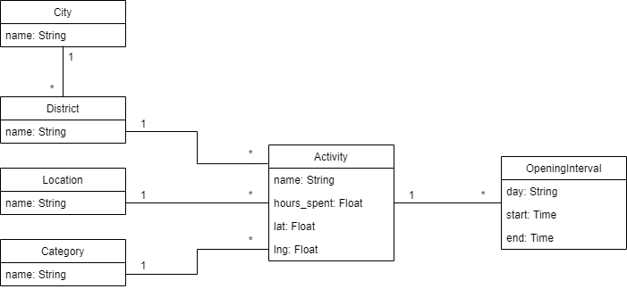

# Support Backend engineer test

## First part

1 - 

Hello, this is a PostGIS query. In a nutshell, it is getting the european countries, their population and number of populated places from the database. 

To do it, the query uses two tables: *european_countries* and *populated_places*, that are joined based on the function `ST_Intersects` applied to their geometries. This function returns true if them share any portion of space, which means, the query is joining the countries with the populated places located in them. The results of the *JOIN* are grouped by the country name. The query returns those names, the number of rows each group had, which will correspond with the number of places, and the sum of the populations of the places; that last value would indicate the total population of the country. 

I hope I have been able to answer your question. If you have any other questions do not hesitate to ask. 

Kind regards.

2 -

Hello, the problem is in this query:

```
SELECT cartodb_id, the_geom, the_geom_webmercator,
FROM ne_10m_populated_places_simple
WHERE ST_intersects(
  the_geom,
  ST_Buffer(
    ST_SetSRID(ST_Point(${lng},${lat}),4326)::geography,
    ${radius})::geometry
  )
```

Right after `the_geom_webmercator` there is a comma (`,`) which should not be there, since `the_geom_webmercator` is the last field of the query. That was causing an error when parsing the query, just remove it and your code should work fine.

There is another issue I have noticed. I do not know if it is something unwanted or not, so I am just pointing it out in case it is. Every time you draw a new circle, the old one is kept on the map. If you want it to be removed, and always show only one circle, just store the old layer in a variable, and remove it from the map when a new one is added. The needed code would be like this:

```
...
// initialise the draw controls
map.addControl(drawControl);
let oldLayer = null;

// get radius and center of drawn circle and change source of the CARTO layer
map.on(L.Draw.Event.CREATED, function (e) {
    if (oldLayer != null)
        map.removeLayer(oldLayer);
    let layer = e.layer;
    oldLayer = layer;
    map.addLayer(layer);
...
```

You can see the variable `oldLayer` that I mentioned, used to store the previous circle and remove it when adding a new one.

I hope I have been able to help you. If you have any other questions do not hesitate to contact me again.

Kind regards.

## Second part

Since the volume of data in *madrid.json* is small, it would have been possible to just parse it and load its content in memory every time the application is executed. But that does not mean it is the right approach. When the number of json files and their size increase, parsing them becomes slower and consumes more memory. 

In order to build a system that scales up well, and that can store a large volume of cities and activities, it would be better to use a database and load the information from *madrid.json* just once.

This project is composed fundamentally by the following files:
* *activity.py*: Implements the API calls.
* *app.py*: The entry point for executing the application.
* *model.py*: Defines the application data model, with its different entities. The Python ORM library *peewee* was used for this.
* *populate_db.py*: Loads the data from *madrid.json* into the database. It can be easily modified to load files corresponding to other cities. Just needs to be ran once.
* swagger.yml: Defines the API structure.       

#### Data model

Looking at *madrid.json* we can deduct one fundamental entity, which is the center of the application: the *Activity*. Activities have a *name*, *opening hours*, an estimate of *hours spent* visiting it, a *category*, *location*, city *district*, and their geographic coordinates: *latitude* and *longitude*. Since all the elements follow the same structures, a relational database was chosen, in this case, for simplicity it was SQLite.

Since the activities will presumably have a restricted number of categories, we could choose to add a value restriction to the corresponding field of the database, or treat categories as a separate entity. The last was the chosen approach, because it avoids repeating the category name for each activity, by just adding it as a foreign key. The same reasoning was applied for the location and district as well. 

In the case of districts, their entity also have the corresponding city as a foreign key, since two different cities can have districts named equally. This decision was also made taking into account that the application could be extended in the future to include more cities, so it seemed reasonable to include them as separate entities.

In order to represent the opening hours of an activity, following the relational model, an OpeningInterval entity was defined, which represents a specific time frame in which an activity is open. These time frames have their starting and ending time, and the day of the week as their attributes, and also a foreign key to the corresponding activity.

Summing up, these entities and relationships can be represented as:



#### API

According to the problem statement, two calls have been defined and implemented:

* `/api/activities`: Receives three optional parameters: `category`, `location` and `district`, indicating the filtering criteria. This call returns a list with the activities matching the specified requirements. If no parameters are received, it will list all the activities, and in case there is no match, the value returned will be an empty list.

* `/api/recommend`: Receives three parameters `day`, `time` and `category`, indicating the day of the week, the time frame (`10:00-12:00` for example), and the category of the activity respectively. This call returns either an activity according to the problem statement, or a HTTP response with code 404 in case no activity can be recommended according to the parameters defined.

In both calls the activities are defined using the GeoJSON format, as the statement indicates. A property named `geojson` has been implemented in the Activity class, in order to map them to that format.

The API behaviour has been implemented in the file *activity.py*. as mentioned before. Two functions: `query` and `recommend` manage respectively each call.

The `query' function is very simple when using peewee as ORM, since it does not execute a query to the database until its objects are directly accessed (indexing or by a loop, for instance). The method starts creating a query for all the activities. Then, it checks if each of the parameters has been included, in which case, adds a corresponding *WHERE* clause to the query. Finally, the method returns a GeoJSON object of type *FeatureCollection*, whose features are the list of activities matching the query, mapped to GeoJSON.

The function `recommed` is a bit more complicated, since it has to deal with time frames. Anyway, it just a question of declaring the right SQL query and letting it do the job. First, the function parses the parameters, splitting the time frame into `start` and `end` time objects, and getting the Category object. Then, we need to make a *JOIN* between the tables *Activity* and *OpeningInterval*, in order to check the opening times of the activities. The activities need to have the indicated category, and the opening intervals need to be for the indicated day, so we add those conditions to the query.

Here is where the harder part begins. We have to indicate that the activities must be able to be completed in the given time frame. We can split the cases where this is possible in two:

* The activity opens before the user's time frame starts: Here the user would start their visit when their interval starts, so there has to be enough time for them to complete it (according to its average time spent), before the activity closes and before the user's time frame ends. Both conditions have to be met.
* The user's time frame starts before the activity opening: The user has to wait until the activity opens, and then their visit begins. There has to be enough time to complete it before the user's time frame ends. In this case there is no need to check if there is enough time before the activity closes, since in this case the visit is starting right at the moment the activity opens.

Finally, according to the problem statement, in case there is more than one possibility, the activity with the longest visit time has to be returned, so we order the query results decreasingly, and return the first item. If the query result was empty, the function returns the HTTP code 404, as indicated before.

### Installation

In order to execute the application, you just need to have Python 3.7 installed in your machine (any version from 3.6 should work fine, but only 3.7 has been tested). 

You might also need the *virtualenv* module, in case you do not have it already. In that case, you can easily install it using your package manager in Linux (Python for Windows already includes it). For instance, for Ubuntu the installation command for *virtualenv* will be:

```bash
sudo apt install virtualenv
```

Next, just configure a virtualenv for the application, activate it and install the requirements indicated in the file *requirements.txt*. You just have to execute the following commands:

```bash
virtualenv -p python3 venv
source venv/bin/activate
pip install -r requirements.txt
```

Finally, in order to populate the database with the content of *madrid.json*, run the script *populate_db.py*:

```bash
python populate_db.py
```

## Running

In order to run the application, just execute te following commands:

```bash
source venv/bin/activate
python app.py
```

This will run the API in the port 5000 by default. If you need to use a different port, just add it as a parameter when running the script. For instance, in order to run it bound to the port 8000, use this command:

```bash
python app.py 8000
```

If everything is correct. The application should be up and running. You can find a live version running at this address as well: http://18.130.227.246:5000.