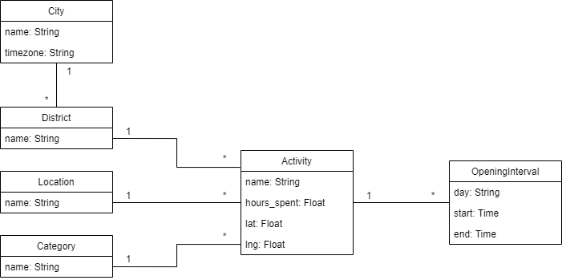

# Support Backend engineer test

## First part

TODO

## Second part

Since the volume of data in *madrid.json* is small, it would have been possible to just parse it and load its content in memory every time the application is executed. But that does not mean it is the right approach. When the number of json files and their size increase, parsing them becomes slower and consumes more memory. 

In order to build a system that scales up well, and that can store a large volume of cities and activities, it would be better to use a database and load the information from *madrid.json* just once.

This project is composed fundamentally by the following files:
* *activity.py*: Implements the API calls.
* *app.py*: The entry point for executing the application.
* *model.py*: Defines the application data model, with its different entities. The Python ORM library *peewee* was used for this.
* *populate_db.py*: Loads the data from *madrid.json* into the database. It can be easily modified to load files corresponding to other cities. Just needs to be ran once.
* swagger.yml: Defines the API structure.       

#### Data model

Looking at *madrid.json* we can deduct one fundamental entity, which is the center of the application: the *Activity*. Activities have a *name*, *opening hours*, an estimate of *hours spent* visiting it, a *category*, *location*, city *district*, and their geographic coordinates: *latitude* and *longitude*. Since all the elements follow the same structures, a relational database was chosen, in this case, for simplicity it was SQLite.

Since the activities will presumably have a restricted number of categories, we could choose to add a value restriction to the corresponding field of the database, or treat categories as a separate entity. The last was the chosen approach, because it avoids repeating the category name for each activity, by just adding it as a foreign key. The same reasoning was applied for the location and district as well. 

In the case of districts, their entity also have the corresponding city as a foreign key, since two different cities can have districts named equally. This decision was also made taking into account that the application could be extended in the future to include more cities, so it seemed reasonable to include them as separate entities.

In order to represent the opening hours of an activity, following the relational model, an OpeningInterval entity was defined, which represents a specific time frame in which an activity is open. These time frames have their starting and ending time, and the day of the week as their attributes, and also a foreign key to the corresponding activity.

Summing up, these entities and relationships can be represented as:



#### API

According to the problem statement, two calls have been defined and implemented:

* `/api/activities`:

* `/api/recommend`:

### Installation

In order to execute the application, you just need to have Python 3.7 installed in your machine (any version from 3.6 should work fine, but only 3.7 has been tested). 

You might also need the *virtualenv* module, in case you do not have it already. In that case, you can easily install it using your package manager in Linux (Python for Windows already includes it). For instance, for Ubuntu the installation command for *virtualenv* will be:

```bash
sudo apt install virtualenv
```

Next, just configure a virtualenv for the application, activate it and install the requirements indicated in the file *requirements.txt*. You just have to execute the following commands:

```bash
virtualenv -p python3 venv
source venv/bin/activate
pip install -r requirements.txt
```

Finally, in order to populate the database with the content of *madrid.json*, run the script *populate_db.py*:

```bash
python populate_db.py
```

## Running

In order to run the application, just execute te following commands:

```bash
source venv/bin/activate
python app.py
```

This will run the API in the port 5000 by default. If you need to use a different port, just add it as a parameter when running the script. For instance, in order to run it bound to the port 8000, use this command:

```bash
python app.py 8000
```

If everything is correct. The application should be up and running. You can find a live version running at this address as well: http://18.130.227.246:5000.